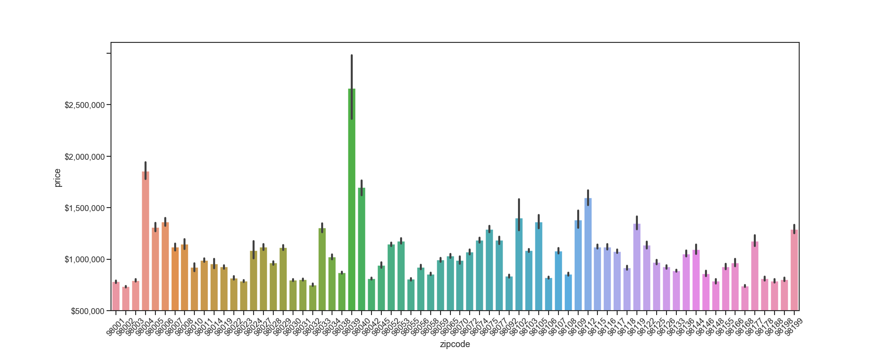
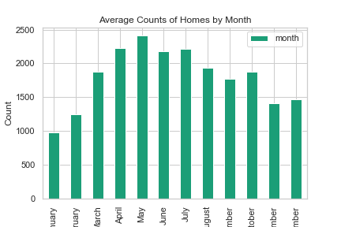
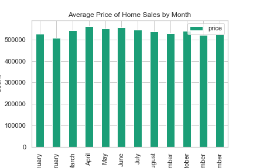
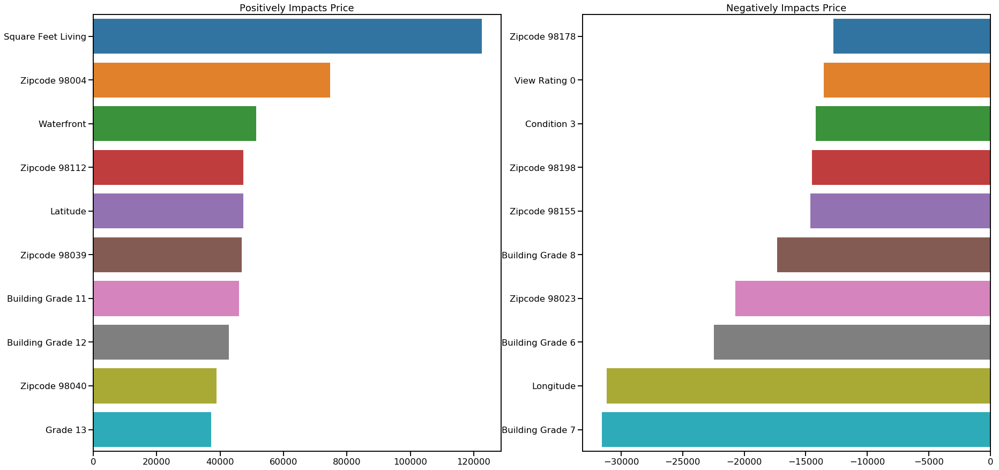

# King County House Sales

Team: Kelly Epley and Emefa Agodo


The King Count Housing dataset contains information about houses in King County Washington. We're going to use it to see if we can predict the future house sale values.

You can find the dataset here: 'https://raw.githubusercontent.com/learn-co-students/dsc-v2-mod1-final-project-dc-ds-career-042219/master/kc_house_data.csv'


### Background

You can zoom in and scroll aroung on the map to see that the most expensive houmes in King County are concentrated on the waterfront and close to Seattle.


```python
%run Bokehmap_KC
```


    <div class="bk-root">
        <a href="https://bokeh.pydata.org" target="_blank" class="bk-logo bk-logo-small bk-logo-notebook"></a>
        <span id="1050">Loading BokehJS ...</span>
    </div>


  <div class="bk-root" id="989aa001-798f-4968-adb0-b1bc1c510ca7" data-root-id="1003"></div>


### About the data

Each observation is a house sale. Each house sale has a unique id, date sold, and price.

The rest of the columns are the ones we used to make predictions. We'll break these down into categories:

#### House Features

* sqft_living –  square footage of the house
* sqft_lot – square footage of the lot
* sqft_above – square footage of house that is above ground
* sqft_basement – square footage of the basement (below ground)
* floors – total floor (levels) in house
* bedrooms – the umber of bedrooms in the house
* bathrooms – the number of bathrooms in the house
* view – a rating of the views from the house

#### Ratings

* condition – a rating of the house's condition
* grade – a rating of the house's construction

#### Location

* waterfront – whether the house is located waterfront
* lat – latitude coordinate
* long – longitude coordinate
* zipcode 

#### Age

* yr_built – year home built
* yr_renovated – when house was renovated

#### Features of Nearby Houses
* sqft_living15 – the square footage of the nearest 15 houses
* sqft_lot15 – the square footage the nearest 15 lots


### Preparing the data

Here are some observations we made and what we did to prepare our data for modeling. 

#### Location matters

As the map above shows, there are discernable patterns in house price by location. Does zipcode track that?



Since we see a lot of variance in the zipcodes by price, it seems that it does. 

We created a dummy variable for each zipcode so that we could use it in our price predicion model. A dummy variable takes a categorical column of a dataframe and turns it in to a bunch of columns. Then for each observation, we identify it as being a "yes" or "no" for that zipcode.

#### Age and Renovation matter

The year built and the recency of renovation matter. So to capture this, we binned the dates by decade to include them in our model. 

#### Sale date isn't particularly significant

We wondered whether the time of year sold would help us predict price. As you can see in the graph below, more houses sell in the Spring.




However, there is little variance in the price by month. Time of year doesn't seem to be a very significant factor in determining the sale price.



If months or seasons had been significant, we could have binned them and turned them into dummy variables the way we did for year built. But since their wasn't much variance, so opted not to.


#### Other dicrete and categorical values

Is the house on a waterfront? How is it's view rated? What's it's condition and grade? How many bedrooms and bathrooms does it have? Those seem relevant for predicting price, so we created dummy variables so that they can be used in our model.


## Feature selection and modeling


When you're building a model, it's best to hone in on the best, most predictive features. Too many features can lead to overfitting. An overfit model performs very well when applied to the data that was used to create it, but doesn't make accurate predictions with new data because it's too closely tailored.  

We could make our best estimation of the right combination of features, trying to remove some features that are highly correlated with other features and just select what we think will be most predictive, but there are so many to choose from! In this case, we thought it would be best to use an algorithm that takes out the guesswork. 

We chose several strategies to compare: 

* A stepwise selection function 
* A Lasso regression model
* A Ridge regression model

 


### Follow Along

Hit shift+enter to run the cell below so you can follow along with our results.


```python
%load_ext autoreload
%autoreload 1
%reload_ext autoreload

%run packages.py
%run cleaning.py

from cleaning import *


clean_house=clean()
```

    The autoreload extension is already loaded. To reload it, use:
      %reload_ext autoreload


## The Models

### Statsmodels OLS

For our first model, we found a handy stepwise selection function on Flatiron's learning platform, learn.co. It chooses all of the features with the features with the lowest p values to use in our model.

The result was was a list of features that we used to create a new dataframe. Then, we fit the data to an Ordinary Least Squares Regression model from the Statsmodels Python package. 


```python
clean_house_selections_list = ['price', 'sqft_living', 'view_4.0', 'lat', 'zipcode_98004', 'zipcode_98039', 'zipcode_98112', 'zipcode_98040', 'view_0.0', 'grade_12', 'grade_13', 'grade_11', 'grade_10', 'waterfront_1.0', 'grade_9', 'zipcode_98105', 'zipcode_98119', 'condition_5', 'zipcode_98109', 'zipcode_98199', 'zipcode_98155', 'zipcode_98102', 'zipcode_98122', 'zipcode_98033', 'zipcode_98103', 'zipcode_98115', 'zipcode_98117', 'zipcode_98116', 'zipcode_98006', 'zipcode_98107', 'zipcode_98144', 'zipcode_98005', 'zipcode_98136', 'zipcode_98008', 'yr_renovated_(2000, 2010]', 'bathrooms_7.75', 'zipcode_98029', 'zipcode_98052', 'sqft_basement', 'sqft_above', 'condition_4', 'bathrooms_8.0', 'view_3.0', 'zipcode_98027', 'zipcode_98126', 'zipcode_98007', 'bathrooms_6.0', 'sqft_living15', 'zipcode_98118', 'bathrooms_4.75', 'yr_built_(2010, 2020]', 'zipcode_98019', 'sqft_lot', 'zipcode_98077', 'zipcode_98028', 'floors_3.0', 'grade_8', 'floors_2.0', 'bedrooms_3', 'bathrooms_4.25', 'zipcode_98011', 'bathrooms_3.25', 'yr_renovated_(2010, 2020]', 'zipcode_98014', 'zipcode_98072', 'zipcode_98133', 'zipcode_98022', 'zipcode_98178', 'bathrooms_3.75', 'bathrooms_4.5', 'bedrooms_7', 'bathrooms_4.0', 'bathrooms_5.5', 'bathrooms_5.25', 'bathrooms_5.0', 'bathrooms_6.25', 'yr_renovated_(1990, 1999]', 'zipcode_98010', 'yr_built_(1930, 1939]', 'zipcode_98075', 'zipcode_98038', 'bedrooms_6', 'floors_2.5', 'bathrooms_5.75', 'bedrooms_10', 'zipcode_98168', 'bedrooms_9', 'bedrooms_5', 'condition_1', 'yr_built_(1920, 1929]', 'zipcode_98074', 'zipcode_98053', 'sqft_lot15', 'zipcode_98106', 'bathrooms_2.25', 'zipcode_98198', 'zipcode_98058', 'bathrooms_1.0', 'bathrooms_3.0']

# Made a new DF with just the features from our selections list

clean_house_selections = clean_house[clean_house_selections_list]

# Fit our data to Statsmodels OLD

y = clean_house_selections["price"] #target
X = clean_house_selections.drop(['price'], axis=1) #predictors

predictors_int = sm.add_constant(X) #OLS requires adding a "constant column to your predictors dataframe (X)
model = sm.OLS(y, predictors_int).fit()
```

### Lasso and Ridge

We also tried Lasso and Ridge methods to see whether their different selection methods made a significant difference in the model's accuracy.

First, we standardized our data using Scikitlearn's StandardScaler, which takes each data point, subtracts the sample mean, and divides by the sample standard deviation. Standardizing also helps us to compare coefficients after we run the model so that we can see how much each feature influences the target variable when the units of measurement differ. 

We also split the data into training and testing sets so we could test our models. Here's a summary of the results. Note that there were 172 features in our clean dataset.

Here's how we created our Lasso and Ridge the models:


```python
#Scaling the data with Standard Scaler

clean_house_predictors = clean_house.drop(["price"], axis=1)

ss_scaler = preprocessing.StandardScaler()
clean_house_ss = ss_scaler.fit_transform(clean_house_predictors)

# Standard Scaler returns a numpy array, so we converted it back to a data frame.

clean_house_ss = pd.DataFrame(clean_house_ss, columns=list(clean_house_predictors.columns))

# Reserve %20 of the data to test the model.

y = clean_house["price"]
X = clean_house_ss

X_train,X_test,y_train,y_test=train_test_split(X,y,test_size=0.2,random_state=3)

# Fit the data to Lasso

lasso = Lasso(alpha=20)
lasso.fit(X_train, y_train)

# FIt the data to Ridge

ridge = Ridge()
ridge.fit(X_train, y_train)

# Checked the training/test R2 scores of our model 

print("Lasso training score:", lasso.score(X_train,y_train))
print("Lasso test score: ", lasso.score(X_test,y_test))

print("Ridge training score:", ridge.score(X_train,y_train))
print("Ridge test score: ", ridge.score(X_test,y_test))
```

    Lasso training score: 0.8452252423626986
    Lasso test score:  0.8334261550862682
    Ridge training score: 0.8452266684539361
    Ridge test score:  0.8334309888643732


### Model Summary

| Method | # of Features Used | Train R2 | Test R2|
| --- | --- | --- | --- |
| OLS | 103 | .843 | - |
| Lasso | 163 | .845 | .833 | 
| Ridge | 172 | .845 | .833

*Note that ridge does not get rid of any features, but it reduced some coefficients (about 5) to very small numbers.

### Cross validation

When you're testing models, it's important to do more to validate your results than one train/test split. You could, by chance get a really unrepresentative sample.

We can avoid this problem with cross validation by splitting our data into several folds. Each fold gets a turn being the test set while the others are the training set. Then we can get a mean of the training set.

Here's a comparison of our R2 results:

| Method | CV 5 | CV 10 | 
| --- | --- | --- | 
| Lasso | .811 | .813 |
| Ridge | .811 | .813 | 

They performed about the same. Click the cell below to see for yourself:


```python

print("Lasso CV 5: ", np.mean(cross_val_score(lasso, X, y, cv=5, scoring="r2")))
print("Lasso CV 10: ", np.mean(cross_val_score(lasso, X, y, cv=10, scoring="r2")))
print("Ridge CV 5: ", np.mean(cross_val_score(ridge, X, y, cv=5, scoring="r2")))
print("Ridge CV 10: ", np.mean(cross_val_score(ridge, X, y, cv=10, scoring="r2")))
```

    Lasso CV 5:  0.8110965793408275
    Lasso CV 10:  0.8133217653967574
    Ridge CV 5:  0.8110349733464333
    Ridge CV 10:  0.813260368099454


### Interpreting the results

We used barplots to help us compare our standardized coefficients from the Lasso model so that we could interpret the results.

Here are the 8 largest positive and negative influences on price:



Note that these are standardized coeficients so we can compare the magnitude of their impact without the complication of differences in unit size.

It's not surprising that square feet of living space, building grade, choice location, and being waterfont make a large positive impact on house sale price. Nor is it surprising that poor view rating, poor condition and undesirable location make a large negative impact.

What's surprising is that grades 6, 7, and 8 appear to have a large negative impact. Those are middle grades, and you'd expect them to be neutral or positive.

One possibility is that there is that there is an unseen factor at work. These features could be proxies for something else that importantly affects house sale price. For example, the bulk of houses with these rating may be suburban homes with long commutes to Seattle. So it could be that long commute time does the explanatory work rather than the condition of the house. This is an area for futher investigation.

Factors that weren't significant included: Renovations that happened a very long time ago; Condition 4 (below code); Grade 4; 1 bedroom; 8 bedrooms; 1 bathroom; and 5.5 bathrooms. 

It makes sense that renovations that happened long ago wouldn't ahve a significant effect on sale value over time as the house ages and passes from owner to owner. 

The reletively low condition and grade scores are more surprising. You'd expect them to affect value negatively. Again, it may be that other factors explain this. For example, sometimes aging and poorly maintained houses get an increase in value because the neighborhood has become desirable. New residents are knocking down old houses and building newer ones in their place. So we might speculate that in King County, desirable lots makes up for the value of houses in disrepair. This is another area for further investigation.

The number of bedrooms and bathrooms is also unintuitive. One possible explanation is that there is diminishing utility above a certain threshold. Under the threshold, each additional bedroom or bathroom adds additional value because it is useful. Above a threshold, it's less and less useful, so it adds less to the value of the house.  


```python

```

